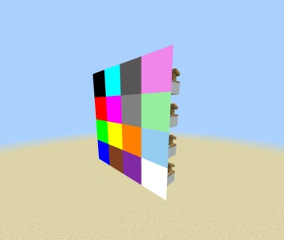

- ## What is it for?
It allows you to create color display using the signal strength of redstone dust. So you have 16 possibilities. Besides, you can edit the assets of each signal strength to display what you want!



---

- ## How does it work?
You simply place a comparator where you want the display, right-click it with a compass, and if you see the message `Block added as...` in the chat, place a redstone dust and you're done!

Now, to display the other colors, you just need to adjust the signal strength.


> [!NOTE]
> To remove the display, place the comparator back and right-click with the compass. If the message `Block removed at...` appears in the chat, it means it has been removed successfully.

---

- ## Editing assets
If you want to edit the assets, you can go to the [Resource Pack](https://github.com/TheSilver1023/Color-Display/tree/main/Color%20Display/Resource%20Pack) and in the `particles` folder you will find the image `redstone_assets.jpg`


> [!IMPORTANT]
> You should try to make the image `16px * 256px` to avoid errors.

> [!TIP]
> I recommend that when importing the Resource Pack and the Behavior Pack, go to the game folder and move the folders to the following ones: `development_behavior_packs` and `development_resource_packs`.
> This will help you when editing an image or its display size. Changes will be applied without much complication.
---

- ## Editing display sizes
To edit the size, go to the [Resource Pack](https://github.com/TheSilver1023/Color-Display/tree/main/Color%20Display/Resource%20Pack) folder in the `particles` folder and in the `redstone.json` file, look for the key `minecraft:particle_appearance_billboard` and you can edit the `size`:
```json
"minecraft:particle_appearance_billboard": {
    "size": [ 1.5, 1.5],   
    "facing_camera_mode": "direction_z",
    "uv": {
        "texture_width": 16,
        "texture_height": 256,
        "uv_size": [ 16, 16 ],
        "uv": [ 0, "variable.x" ]
     }
```

> [!NOTE]
> One block equals "0.5". For example, if you want it to measure 2 blocks wide and long, it would be equal to `1`
---

- ## Download
To download the Addon, simply click [DOWNLOAD](https://github.com/TheSilver1023/Color-Display-MCBE/releases/download/v1.0/Color.Display.mcaddon).
