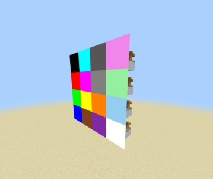
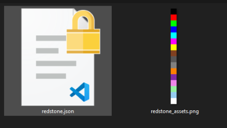

# Guía en Español

---

- ## ¿Para que sirve?
Permite realizar pantallas a color mediante la intensidad de las gotas de redstone. Por lo que tienes 16 posibilidades. Además de que se pueden editar las imágenes de cada intensidad para mostrar lo que deseas!



---

- ## ¿Cómo funciona?
Simplemente colocan un comparador en el lugar donde quieren la pantalla, le dan clic derecho con una brújula y, si te sale en el chat el mensaje `Block added as...`, ponen una gota de redstone ¡y listo!

Ahora, para mostrar los demás colores, simplemente deben ajustar la intensidad de la redstone.


---

- ## Editar las imágenes
Si desean editar las imágenes, pueden ir al [Resource Pack](https://github.com/TheSilver1023/Color-Display/tree/main/Color%20Display/Resource%20Pack) y en la carpeta `particles` encontrarán la imágen `redstone_assets.jpg`



> [!IMPORTANT]
> Deben tratar de que la imágen sea de `16px * 256px` para evitar fallos.

> [!TIP]
> Les recomiendo que al importar el Resource Pack y el Behavior Pack, vayan a la carpeta del juego y trasladen las carpetas a las siguientes: `development_behavior_packs` y `development_resource_packs`.
> Esto les servirá para cuando editen una imágen, o el tamaño. Se le cumplan los cambios si mucha complicación.
---

- ## Editar tamaño de las pantallas
Para poder editar el tamaño, van a dirigirse a la carpeta de [Resource Pack](https://github.com/TheSilver1023/Color-Display/tree/main/Color%20Display/Resource%20Pack) en la carpeta `particles` y en el archivo `redstone.json` van a buscar la clave `minecraft:particle_appearance_billboard` y van a poder editar el `size`:
```json
"minecraft:particle_appearance_billboard": {
    "size": [ 1.5, 1.5],   
    "facing_camera_mode": "direction_z",
    "uv": {
        "texture_width": 16,
        "texture_height": 256,
        "uv_size": [ 16, 16 ],
        "uv": [ 0, "variable.x" ]
     }
```
> [!NOTE]
> Un bloque equivale a "0.5". Ejemplo, si quieres que mida 2 bloques de ancho y largo, sería igual a `1`
---

- ## Descarga
Para descargar el Addon, simplemente haga click en [DESCARGAR](https://github.com/TheSilver1023/Color-Display-MCBE/releases/download/v1.0/Color.Display.mcaddon).
